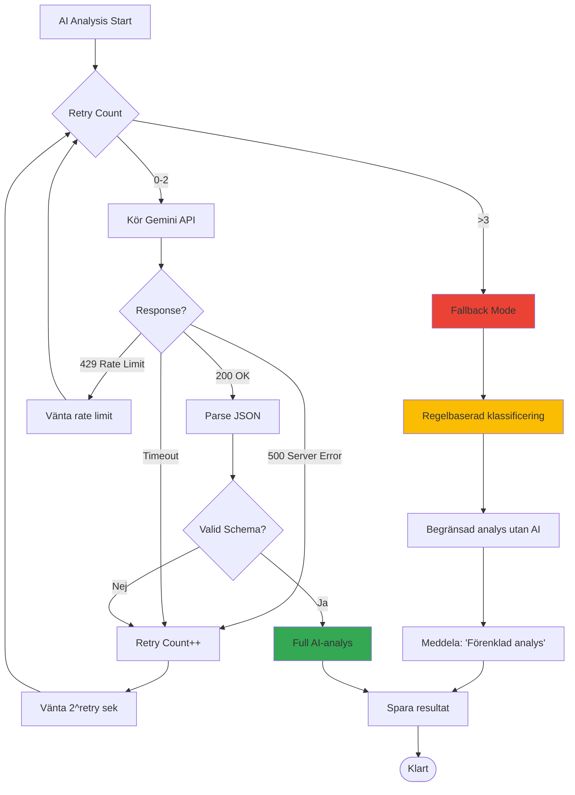

# Elton Inspector - AI Analysis Pipeline

## Detailed Sequence Diagram

```mermaid
sequenceDiagram
    autonumber
    participant U as Användare
    participant App as React Native App
    participant Auth as Firebase Auth
    participant Store as Cloud Storage
    participant DB as Firestore
    participant CF as Cloud Function
    participant Cache as Redis Cache
    participant Gemini as Gemini 2.5 API
    participant NLP as NLP Processor
    participant Task as Task Creator
    
    Note over U,Task: Phase 1: Capture & Upload
    
    U->>App: Tar foto av rostskada
    App->>App: Komprimera bild (80% kvalitet)
    App->>App: Generera thumbnail (200x200)
    
    App->>Auth: Verifiera token
    Auth-->>App: Token OK
    
    App->>Store: Upload full image
    Store-->>App: imageUrl
    
    App->>Store: Upload thumbnail
    Store-->>App: thumbnailUrl
    
    App->>DB: Skapa Finding (status: pending)
    Note right of DB: {<br/>  id: "find_123",<br/>  status: "pending",<br/>  imageUrl: "...",<br/>  category: "EXTERIOR"<br/>}
    DB-->>App: Finding created
    
    App->>U: Visa "Analyserar..."
    
    Note over U,Task: Phase 2: Trigger Analysis
    
    App->>CF: Call analyzeFinding(findingId)
    CF->>DB: Hämta Finding
    DB-->>CF: Finding data
    
    CF->>Cache: Check cache för liknande bild
    Note right of Cache: Hash baserat på<br/>perceptual hashing
    
    alt Cache Hit (samma bild tidigare)
        Cache-->>CF: Cached analysis
        CF->>CF: Adjust confidence (-10%)
        CF->>DB: Uppdatera med cached result
        CF-->>App: Analysis complete
    else Cache Miss
        CF->>Store: Download image
        Store-->>CF: Image bytes
        
        Note over CF,Gemini: Phase 3: AI Analysis
        
        CF->>CF: Bygg context prompt
        Note right of CF: Inkluderar:<br/>- Zone context<br/>- Checkpoint info<br/>- Vehicle year<br/>- Previous findings
        
        CF->>Gemini: Send image + prompt
        Note right of Gemini: Model: gemini-2.5-flash<br/>Max tokens: 2048<br/>Temperature: 0.3
        
        Gemini->>Gemini: Vision analysis
        Gemini->>Gemini: Component identification
        Gemini->>Gemini: Condition assessment
        Gemini->>Gemini: Severity classification
        
        Gemini-->>CF: JSON Response
        Note left of Gemini: {<br/>  "diagnosis": "...",<br/>  "severity": "WARNING",<br/>  "confidence": 75,<br/>  ...<br/>}
        
        Note over CF,Task: Phase 4: Post-processing
        
        CF->>CF: Validate JSON schema
        
        alt Invalid JSON
            CF->>CF: Retry med explicit schema
            CF->>Gemini: Retry request
            Gemini-->>CF: JSON Response
        end
        
        CF->>CF: Confidence calibration
        Note right of CF: Justera baserat på:<br/>- Image quality<br/>- Zone difficulty<br/>- Historical accuracy
        
        CF->>NLP: Förbättra svensk grammatik
        NLP-->>CF: Polerad text
        
        CF->>CF: Generera suggestedActions
        Note right of CF: Baserat på:<br/>- Severity<br/>- Component type<br/>- Cost database
        
        CF->>CF: Determine investigation steps
        
        alt Konfidens < 80%
            CF->>CF: Add Level 2 investigation
        end
        
        CF->>Cache: Spara i cache
        Cache-->>CF: Cached
        
        Note over CF,Task: Phase 5: Severity Handling
        
        alt Severity == CRITICAL
            CF->>Task: Auto-create task
            Task->>DB: Create Task document
            Note right of DB: {<br/>  title: "Åtgärda rost",<br/>  priority: "HIGH",<br/>  dueDate: +7 days<br/>}
            Task-->>CF: taskId
            
            CF->>CF: Länka task till finding
            
            CF->>App: Send push notification
            Note right of CF: "Kritiskt fynd:<br/>Rost i bärande del"
        end
        
        alt Severity == WARNING && Konfidens > 85%
            CF->>App: Suggest task creation
        end
        
        Note over CF,DB: Phase 6: Save Results
        
        CF->>DB: Uppdatera Finding
        Note right of DB: {<br/>  status: "analyzed",<br/>  aiAnalysis: {...},<br/>  convertedToTaskId: "..."<br/>}
        
        DB-->>CF: Update successful
        CF-->>App: Analysis complete
    end
    
    Note over App,U: Phase 7: Display Results
    
    DB->>App: Real-time update (onSnapshot)
    App->>App: Format result for display
    App->>U: Visa detaljerat resultat
    
    U->>App: Läser diagnos
    
    alt User wants details
        U->>App: Tryck på "Visa detaljer"
        App->>U: Expandera med:<br/>- Confidence meter<br/>- Suggested actions<br/>- Cost estimate<br/>- Investigation steps
    end
    
    alt User creates task manually
        U->>App: Tryck "Skapa task"
        App->>DB: Create task
        DB-->>App: taskId
        App->>DB: Länka till finding
        App->>U: Bekräftelse
    end
    
    Note over U,Task: Analysis Complete
```



## Processing Time Breakdown

```mermaid
gantt
    title AI Analysis Timeline (Target vs. Actual)
    dateFormat  s
    axisFormat %S
    
    section Upload
    Compress image      :a1, 0, 1s
    Upload to Storage   :a2, after a1, 2s
    Create Finding doc  :a3, after a2, 1s
    
    section AI Processing
    Download from Storage :b1, after a3, 1s
    Gemini Vision API     :b2, after b1, 4s
    Parse & Validate      :b3, after b2, 1s
    
    section Post-Process
    NLP Enhancement       :c1, after b3, 1s
    Generate Actions      :c2, after c1, 1s
    Save to Firestore     :c3, after c2, 1s
    
    section Display
    Real-time Update      :d1, after c3, 1s
```



**Total Target Time: ~13 sekunder**

## Error Handling Flow



## Gemini API Call Details

### Request Structure

```json
{
  "model": "gemini-2.5-flash",
  "contents": [{
    "role": "user",
    "parts": [
      {
        "text": "SYSTEM_PROMPT + ZONE_CONTEXT + USER_CONTEXT"
      },
      {
        "inlineData": {
          "mimeType": "image/jpeg",
          "data": "BASE64_ENCODED_IMAGE"
        }
      }
    ]
  }],
  "generationConfig": {
    "temperature": 0.3,
    "maxOutputTokens": 2048,
    "topP": 0.95,
    "topK": 40
  },
  "safetySettings": [
    {
      "category": "HARM_CATEGORY_DANGEROUS_CONTENT",
      "threshold": "BLOCK_NONE"
    }
  ]
}
```

### Expected Response Structure

```json
{
  "candidates": [{
    "content": {
      "parts": [{
        "text": "{
          \"diagnosis\": \"Kraftig korrosion på längsgående balk höger sida\",
          \"component\": \"Längsgående balk höger\",
          \"severity\": \"CRITICAL\",
          \"confidence\": 88,
          \"urgency\": \"IMMEDIATE\",
          \"condition\": {
            \"overall\": \"CRITICAL\",
            \"rust\": {
              \"level\": \"SEVERE\",
              \"location\": \"Mittsektionen, nära bakre fjäderfäste\",
              \"isPenetrating\": true,
              \"affectsStructure\": true
            }
          },
          \"suggestedActions\": [
            {
              \"type\": \"REPAIR\",
              \"description\": \"Byt ut rostskadad sektion av längsbalk\",
              \"difficulty\": \"SPECIALIST\",
              \"estimatedHours\": 8,
              \"priority\": 1
            },
            {
              \"type\": \"INVESTIGATE\",
              \"description\": \"Kontrollera även vänster sida\",
              \"difficulty\": \"DIY\",
              \"priority\": 2
            }
          ],
          \"estimatedCost\": {
            \"min\": 12000,
            \"max\": 25000,
            \"currency\": \"SEK\",
            \"breakdown\": {
              \"parts\": 5000,
              \"labor\": 15000
            }
          },
          \"requiresExpert\": true,
          \"nextSteps\": [
            {
              \"level\": 3,
              \"instruction\": \"Boka professionell inspektion med lyft\",
              \"toolsNeeded\": [\"Lyft\", \"Rostmätare\"]
            }
          ]
        }"
      }]
    },
    "finishReason": "STOP"
  }],
  "usageMetadata": {
    "promptTokenCount": 1250,
    "candidatesTokenCount": 450,
    "totalTokenCount": 1700
  }
}
```

## Performance Optimization Strategies

### 1. Image Optimization

```typescript
// Före upload
async function optimizeImage(uri: string): Promise<string> {
  // Resize till max 1920x1080 (bevara aspect ratio)
  const resized = await ImageResizer.resize(uri, 1920, 1080, 'JPEG', 80);
  
  // Strip EXIF data (privacy)
  const stripped = await stripExif(resized.uri);
  
  // Blur licensplåtar om detekterade
  const safe = await blurPlates(stripped);
  
  return safe;
}
```

### 2. Parallel Processing

```typescript
// Kör flera steg parallellt
async function analyzeInParallel(findingId: string) {
  const [image, metadata, relatedFindings] = await Promise.all([
    downloadImage(findingId),
    fetchMetadata(findingId),
    findRelatedFindings(findingId)
  ]);
  
  const enrichedPrompt = buildPrompt(metadata, relatedFindings);
  const result = await callGemini(image, enrichedPrompt);
  
  return result;
}
```

### 3. Caching Strategy

```typescript
// Perceptual hash för bildlikhet
import phash from 'phash';

async function checkCache(imageData: Buffer): Promise<AIAnalysis | null> {
  const hash = await phash.hash(imageData);
  
  // Hitta liknande bilder (hamming distance < 10)
  const similar = await redis.get(`analysis:${hash}`);
  
  if (similar) {
    console.log('Cache hit - similar analysis found');
    return JSON.parse(similar);
  }
  
  return null;
}

async function saveToCache(imageData: Buffer, analysis: AIAnalysis) {
  const hash = await phash.hash(imageData);
  await redis.setex(`analysis:${hash}`, 3600, JSON.stringify(analysis));
}
```

### 4. Rate Limiting & Quotas

```typescript
// Exponential backoff för rate limits
async function callWithRetry<T>(
  fn: () => Promise<T>,
  maxRetries: number = 3
): Promise<T> {
  for (let i = 0; i < maxRetries; i++) {
    try {
      return await fn();
    } catch (error) {
      if (error.status === 429 && i < maxRetries - 1) {
        const delay = Math.pow(2, i) * 1000; // 1s, 2s, 4s
        console.log(`Rate limited, waiting ${delay}ms...`);
        await sleep(delay);
      } else {
        throw error;
      }
    }
  }
  throw new Error('Max retries exceeded');
}
```

## Monitoring & Metrics

### Key Metrics att Logga

```typescript
interface AnalysisMetrics {
  findingId: string;
  timestamp: Date;
  
  // Performance
  uploadTime: number;        // ms
  analysisTime: number;      // ms
  totalTime: number;         // ms
  
  // AI
  modelVersion: string;
  confidence: number;
  tokenCount: number;
  
  // Quality
  retryCount: number;
  cacheHit: boolean;
  validationErrors: string[];
  
  // Cost
  estimatedCost: number;     // USD (Gemini pricing)
}
```

### Logging till Analytics

```typescript
analytics.logEvent('inspection_analyzed', {
  category: finding.category,
  severity: analysis.severity,
  confidence: analysis.confidence,
  analysis_time: metrics.analysisTime,
  model_version: analysis.modelVersion,
  cache_hit: metrics.cacheHit
});
```

## Kostnadsberäkning

### Gemini 2.5 Flash Pricing (2025)

| Operation | Cost | Notes |
|-----------|------|-------|
| Input (per 1M tokens) | $0.075 | Text prompts |
| Input (per image) | $0.00025 | Up to 32 images/request |
| Output (per 1M tokens) | $0.30 | Generated text |

### Estimerad kostnad per analys

```
Genomsnittlig analys:
- Input prompt: ~1,500 tokens ($0.0001125)
- 1 image: $0.00025
- Output: ~500 tokens ($0.00015)
─────────────────────────────────────────
Total: ~$0.0005125 per analys

Med 1000 analyser/månad: ~$0.51/månad
```

**Extremt kostnadseffektivt jämfört med manuell inspektion!**

