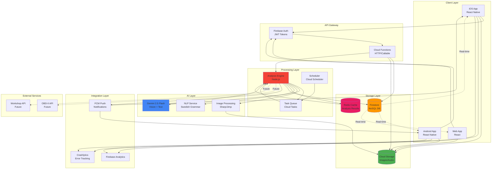

# Elton Inspector - System Architecture

## High-Level Architecture



## Component Details

### 1. Client Layer

#### React Native App (iOS + Android)

**Tech Stack:**
```json
{
  "react-native": "0.73.0",
  "typescript": "5.3.0",
  "dependencies": {
    "react-native-camera": "^4.2.1",
    "react-native-audio-recorder-player": "^3.5.0",
    "@react-native-firebase/app": "^19.0.0",
    "@react-native-firebase/auth": "^19.0.0",
    "@react-native-firebase/firestore": "^19.0.0",
    "@react-native-firebase/storage": "^19.0.0",
    "@react-native-firebase/functions": "^19.0.0",
    "zustand": "^4.4.0",
    "react-native-fast-image": "^8.6.3"
  }
}
```

**State Management:**
```typescript
// Store structure
interface InspectorStore {
  // Current session
  activeInspection: {
    zoneId: string;
    checkpoints: CheckpointProgress[];
    findings: InspectionFinding[];
  } | null;
  
  // Cache
  recentFindings: InspectionFinding[];
  zones: InspectionZone[];
  
  // Actions
  startInspection: (zoneId: string) => void;
  captureImage: (checkpointId: string, uri: string) => Promise<void>;
  uploadAndAnalyze: (data: CaptureData) => Promise<InspectionFinding>;
  
  // Offline support
  pendingUploads: PendingUpload[];
  syncWhenOnline: () => Promise<void>;
}
```

**Offline-First Architecture:**
```typescript
// Offline queue system
class OfflineQueue {
  private queue: QueueItem[] = [];
  
  async add(item: QueueItem) {
    this.queue.push(item);
    await AsyncStorage.setItem('offline_queue', JSON.stringify(this.queue));
    
    if (await NetInfo.fetch().isConnected) {
      this.processQueue();
    }
  }
  
  async processQueue() {
    while (this.queue.length > 0) {
      const item = this.queue[0];
      try {
        await this.uploadItem(item);
        this.queue.shift();
      } catch (error) {
        console.error('Upload failed:', error);
        break; // Stop processing on error
      }
    }
    await AsyncStorage.setItem('offline_queue', JSON.stringify(this.queue));
  }
}
```

### 2. Firebase Backend

#### Firestore Database Structure

```
/users/{userId}
  - email: string
  - displayName: string
  - preferences: map
  - createdAt: timestamp

/vehicles/{vehicleId}
  - userId: string
  - make: string
  - model: string
  - year: number
  - vin?: string

/projects/{projectId}
  - vehicleId: string
  - userId: string
  - name: string
  - status: enum
  - createdAt: timestamp

/inspectionFindings/{findingId}
  - projectId: string
  - userId: string
  - imageUrl?: string
  - audioUrl?: string
  - category: enum
  - zoneId: string
  - checkpointId?: string
  - aiAnalysis: map {
      diagnosis: string
      severity: enum
      confidence: number
      ...
  }
  - convertedToTaskId?: string
  - createdAt: timestamp
  - updatedAt: timestamp

/tasks/{taskId}
  - projectId: string
  - userId: string
  - sourceFindingId?: string
  - title: string
  - priority: enum
  - status: enum
  - dueDate: timestamp

/zones/{zoneId}
  - name: string
  - category: enum
  - checkpoints: array<map>
  - sortOrder: number

/analysisMetrics/{metricId}
  - findingId: string
  - analysisTime: number
  - confidence: number
  - modelVersion: string
  - timestamp: timestamp
```

#### Security Rules

```javascript
rules_version = '2';
service cloud.firestore {
  match /databases/{database}/documents {
    
    // Helper functions
    function isAuthenticated() {
      return request.auth != null;
    }
    
    function isOwner(userId) {
      return request.auth.uid == userId;
    }
    
    // Users
    match /users/{userId} {
      allow read, write: if isOwner(userId);
    }
    
    // Vehicles
    match /vehicles/{vehicleId} {
      allow read, write: if isOwner(resource.data.userId);
    }
    
    // Projects
    match /projects/{projectId} {
      allow read, write: if isOwner(resource.data.userId);
    }
    
    // Inspection Findings
    match /inspectionFindings/{findingId} {
      allow read: if isOwner(resource.data.userId);
      allow create: if isAuthenticated() && isOwner(request.resource.data.userId);
      allow update: if isOwner(resource.data.userId);
      allow delete: if isOwner(resource.data.userId);
    }
    
    // Tasks
    match /tasks/{taskId} {
      allow read, write: if isOwner(resource.data.userId);
    }
    
    // Zones (read-only for all authenticated users)
    match /zones/{zoneId} {
      allow read: if isAuthenticated();
      allow write: if false; // Admin only
    }
  }
}
```

#### Storage Rules

```javascript
rules_version = '2';
service firebase.storage {
  match /b/{bucket}/o {
    
    // User inspection media
    match /inspections/{userId}/{projectId}/{findingId}/{filename} {
      // Allow user to upload their own files
      allow write: if request.auth.uid == userId
                   && request.resource.size < 10 * 1024 * 1024 // 10MB max
                   && request.resource.contentType.matches('image/.*|audio/.*');
      
      // Allow user to read their own files
      allow read: if request.auth.uid == userId;
    }
    
    // Thumbnails (generated server-side)
    match /thumbnails/{userId}/{projectId}/{findingId}/{filename} {
      allow read: if request.auth.uid == userId;
      allow write: if false; // Only Cloud Functions
    }
  }
}
```

### 3. Cloud Functions

#### Function Deployment

```yaml
# firebase.json functions config
{
  "functions": {
    "source": "functions",
    "predeploy": ["npm --prefix functions run build"],
    "runtime": "nodejs20",
    "memory": "2GB",
    "timeoutSeconds": 300,
    "env": {
      "GEMINI_API_KEY": "projects/PROJECT_ID/secrets/gemini-api-key",
      "REDIS_URL": "projects/PROJECT_ID/secrets/redis-url"
    }
  }
}
```

#### Key Functions

```typescript
// functions/src/index.ts

import * as functions from 'firebase-functions';
import { initializeApp } from 'firebase-admin/app';

initializeApp();

// ==========================================
// INSPECTION ANALYSIS
// ==========================================

export const analyzeFinding = functions
  .runWith({
    memory: '2GB',
    timeoutSeconds: 120
  })
  .https.onCall(async (data, context) => {
    // Implemented in previous diagram
  });

// ==========================================
// STORAGE TRIGGERS
// ==========================================

export const onImageUpload = functions
  .storage
  .object()
  .onFinalize(async (object) => {
    const filePath = object.name;
    
    // Generate thumbnail
    if (filePath?.includes('/inspections/')) {
      await generateThumbnail(filePath);
    }
    
    // Auto-trigger analysis if not already queued
    const findingId = extractFindingId(filePath);
    if (findingId) {
      await triggerAnalysis(findingId);
    }
  });

// ==========================================
// SCHEDULED FUNCTIONS
// ==========================================

export const dailyReportGeneration = functions
  .pubsub
  .schedule('0 8 * * *') // 08:00 daily
  .timeZone('Europe/Stockholm')
  .onRun(async (context) => {
    // Generate daily summary for active projects
    await generateDailySummaries();
  });

export const cleanupOldAnalytics = functions
  .pubsub
  .schedule('0 2 * * 0') // 02:00 every Sunday
  .onRun(async (context) => {
    // Delete analytics older than 90 days
    await cleanupAnalytics();
  });

// ==========================================
// FIRESTORE TRIGGERS
// ==========================================

export const onCriticalFinding = functions
  .firestore
  .document('inspectionFindings/{findingId}')
  .onUpdate(async (change, context) => {
    const before = change.before.data();
    const after = change.after.data();
    
    // If severity changed to CRITICAL
    if (after.aiAnalysis?.severity === 'CRITICAL' && 
        before.aiAnalysis?.severity !== 'CRITICAL') {
      
      // Send push notification
      await sendCriticalNotification(after);
      
      // Auto-create task if not already created
      if (!after.convertedToTaskId) {
        await autoCreateTask(context.params.findingId, after);
      }
    }
  });

export const onTaskCreated = functions
  .firestore
  .document('tasks/{taskId}')
  .onCreate(async (snap, context) => {
    const task = snap.data();
    
    // Send notification about new task
    await sendTaskNotification(task);
    
    // Update project statistics
    await updateProjectStats(task.projectId);
  });

// ==========================================
// HELPER FUNCTIONS
// ==========================================

async function generateThumbnail(filePath: string) {
  const sharp = require('sharp');
  const { getStorage } = require('firebase-admin/storage');
  
  const bucket = getStorage().bucket();
  const file = bucket.file(filePath);
  
  const [buffer] = await file.download();
  
  const thumbnail = await sharp(buffer)
    .resize(200, 200, { fit: 'cover' })
    .jpeg({ quality: 80 })
    .toBuffer();
  
  const thumbnailPath = filePath.replace('/inspections/', '/thumbnails/');
  await bucket.file(thumbnailPath).save(thumbnail, {
    contentType: 'image/jpeg'
  });
}

async function sendCriticalNotification(finding: any) {
  const { getMessaging } = require('firebase-admin/messaging');
  
  const message = {
    notification: {
      title: '⚠️ Kritiskt fynd!',
      body: finding.aiAnalysis.diagnosis.substring(0, 100)
    },
    data: {
      type: 'critical_finding',
      findingId: finding.id,
      projectId: finding.projectId
    },
    topic: `user_${finding.userId}`
  };
  
  await getMessaging().send(message);
}
```

### 4. Redis Cache Layer

**Purpose:** Cache AI analysis results för liknande bilder

```typescript
// Redis cache implementation
import Redis from 'ioredis';

const redis = new Redis(process.env.REDIS_URL);

interface CacheEntry {
  analysis: AIAnalysis;
  timestamp: number;
  hitCount: number;
}

export class AnalysisCache {
  
  async get(imageHash: string): Promise<AIAnalysis | null> {
    const key = `analysis:${imageHash}`;
    const cached = await redis.get(key);
    
    if (cached) {
      const entry: CacheEntry = JSON.parse(cached);
      
      // Increment hit count
      entry.hitCount++;
      await redis.setex(key, 3600, JSON.stringify(entry));
      
      // Reduce confidence slightly for cached results
      const analysis = entry.analysis;
      analysis.confidence = Math.max(analysis.confidence - 10, 0);
      
      return analysis;
    }
    
    return null;
  }
  
  async set(imageHash: string, analysis: AIAnalysis) {
    const key = `analysis:${imageHash}`;
    const entry: CacheEntry = {
      analysis,
      timestamp: Date.now(),
      hitCount: 0
    };
    
    // Cache for 1 hour
    await redis.setex(key, 3600, JSON.stringify(entry));
  }
  
  async getCacheStats(): Promise<{hits: number, misses: number}> {
    const hits = await redis.get('cache:hits') || '0';
    const misses = await redis.get('cache:misses') || '0';
    return {
      hits: parseInt(hits),
      misses: parseInt(misses)
    };
  }
}
```

### 5. Monitoring & Observability

#### Cloud Monitoring Metrics

```typescript
// Custom metrics to track
const metrics = {
  // Performance
  'inspection/analysis_time': {
    type: 'histogram',
    unit: 'ms',
    description: 'Time taken for AI analysis'
  },
  
  'inspection/upload_time': {
    type: 'histogram',
    unit: 'ms',
    description: 'Time taken to upload media'
  },
  
  // Quality
  'inspection/confidence_avg': {
    type: 'gauge',
    unit: 'percentage',
    description: 'Average AI confidence score'
  },
  
  'inspection/critical_findings': {
    type: 'counter',
    description: 'Number of critical findings detected'
  },
  
  // Business
  'inspection/completed_per_day': {
    type: 'gauge',
    description: 'Inspections completed daily'
  },
  
  'inspection/task_conversion_rate': {
    type: 'gauge',
    unit: 'percentage',
    description: 'Findings converted to tasks'
  }
};
```

#### Error Tracking

```typescript
// Sentry integration
import * as Sentry from '@sentry/node';

Sentry.init({
  dsn: process.env.SENTRY_DSN,
  environment: process.env.NODE_ENV,
  tracesSampleRate: 0.1,
  
  beforeSend(event, hint) {
    // Filter sensitive data
    if (event.request) {
      delete event.request.cookies;
      delete event.request.headers?.['authorization'];
    }
    return event;
  }
});

// Usage in functions
try {
  await analyzeFinding(findingId);
} catch (error) {
  Sentry.captureException(error, {
    tags: {
      function: 'analyzeFinding',
      findingId
    },
    extra: {
      userId: context.auth?.uid,
      category: finding.category
    }
  });
  throw error;
}
```

## Infrastructure as Code

### Terraform Configuration

```hcl
# main.tf

terraform {
  required_providers {
    google = {
      source  = "hashicorp/google"
      version = "~> 5.0"
    }
  }
}

provider "google" {
  project = var.project_id
  region  = var.region
}

# Firestore Database
resource "google_firestore_database" "database" {
  name        = "(default)"
  location_id = var.region
  type        = "FIRESTORE_NATIVE"
}

# Storage Bucket for Inspections
resource "google_storage_bucket" "inspections" {
  name     = "${var.project_id}-inspections"
  location = var.region
  
  lifecycle_rule {
    condition {
      age = 365 # 1 year
    }
    action {
      type = "Delete"
    }
  }
  
  cors {
    origin          = ["*"]
    method          = ["GET", "POST"]
    response_header = ["*"]
    max_age_seconds = 3600
  }
}

# Redis Instance (Memorystore)
resource "google_redis_instance" "cache" {
  name           = "inspector-cache"
  tier           = "BASIC"
  memory_size_gb = 1
  region         = var.region
  
  redis_version = "REDIS_6_X"
}

# Secret Manager for API Keys
resource "google_secret_manager_secret" "gemini_key" {
  secret_id = "gemini-api-key"
  
  replication {
    automatic = true
  }
}
```

## Deployment Pipeline

```yaml
# .github/workflows/deploy.yml

name: Deploy to Production

on:
  push:
    branches: [main]

jobs:
  test:
    runs-on: ubuntu-latest
    steps:
      - uses: actions/checkout@v3
      - uses: actions/setup-node@v3
        with:
          node-version: '20'
      
      - name: Install dependencies
        run: npm ci
      
      - name: Run tests
        run: npm test
      
      - name: Lint
        run: npm run lint

  deploy-functions:
    needs: test
    runs-on: ubuntu-latest
    steps:
      - uses: actions/checkout@v3
      
      - name: Deploy Cloud Functions
        uses: google-github-actions/deploy-cloud-functions@v1
        with:
          name: analyzeFinding
          runtime: nodejs20
          entry_point: analyzeFinding
          source_dir: functions

  deploy-app:
    needs: test
    runs-on: macos-latest
    steps:
      - uses: actions/checkout@v3
      
      - name: Build iOS
        run: |
          cd ios
          pod install
          xcodebuild -workspace App.xcworkspace -scheme App archive
      
      - name: Upload to TestFlight
        run: xcrun altool --upload-app ...
```

## Scalability Considerations

### Current Capacity

| Resource | Limit | Notes |
|----------|-------|-------|
| Firestore writes/sec | 10,000 | Per database |
| Storage uploads/sec | 5,000 | Per bucket |
| Cloud Functions concurrent | 3,000 | Per region |
| Gemini API requests/min | 60 | Per project |

### Scaling Strategy

**Phase 1 (0-1k users):**
- Single region deployment
- Basic caching
- Gemini 2.5 Flash

**Phase 2 (1k-10k users):**
- Multi-region Firestore
- Redis cluster
- Gemini rate limit increase
- CDN for thumbnails

**Phase 3 (10k+ users):**
- Global load balancing
- Dedicated Gemini quota
- Custom ML models for common cases
- Advanced caching strategies

## Cost Estimation

### Monthly Costs (1000 active users, 10 inspections/user/month)

| Service | Usage | Cost |
|---------|-------|------|
| **Firestore** | 10M reads, 300k writes | $0.60 + $0.54 = $1.14 |
| **Cloud Storage** | 100GB storage, 50GB egress | $2.00 + $6.00 = $8.00 |
| **Cloud Functions** | 10M invocations, 2GB-sec | $0.40 + $0.25 = $0.65 |
| **Gemini API** | 10k analyses (~$0.51 each) | $5.10 |
| **Redis** | 1GB instance | $30.00 |
| **Firebase Auth** | Free tier | $0.00 |
| **FCM** | Free tier | $0.00 |
| **Total** | | **~$45/month** |

**Per-user cost: $0.045/month** (~0.50 SEK)

Extremt kostnadseffektivt!

