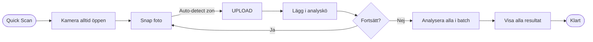
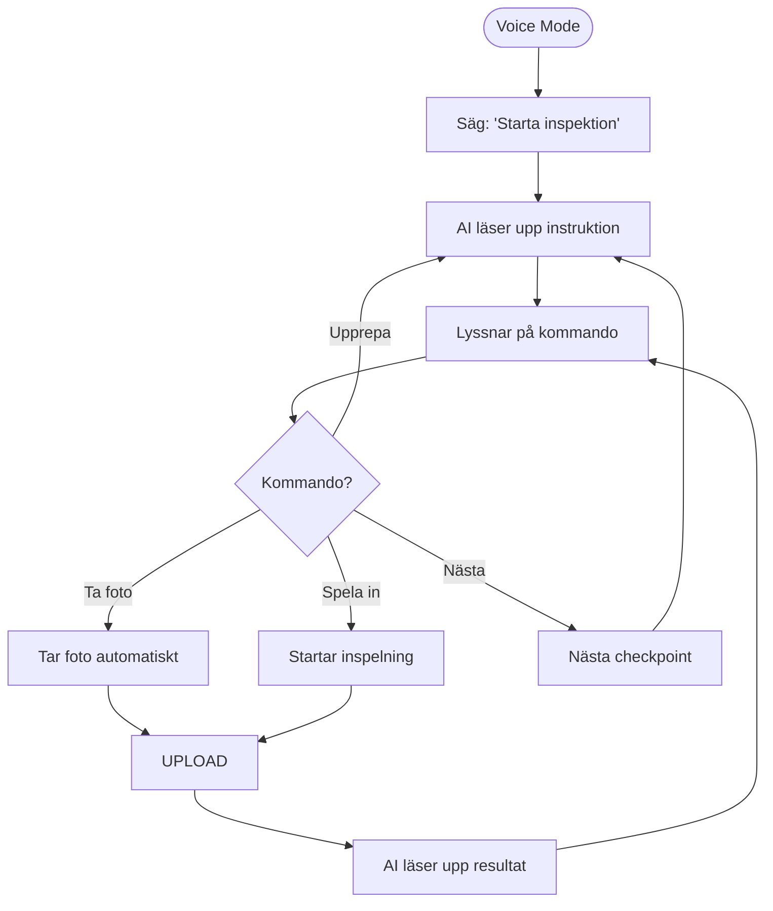
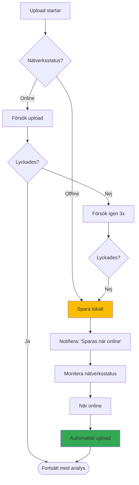
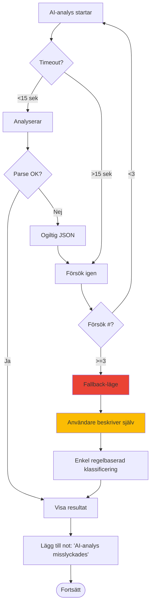
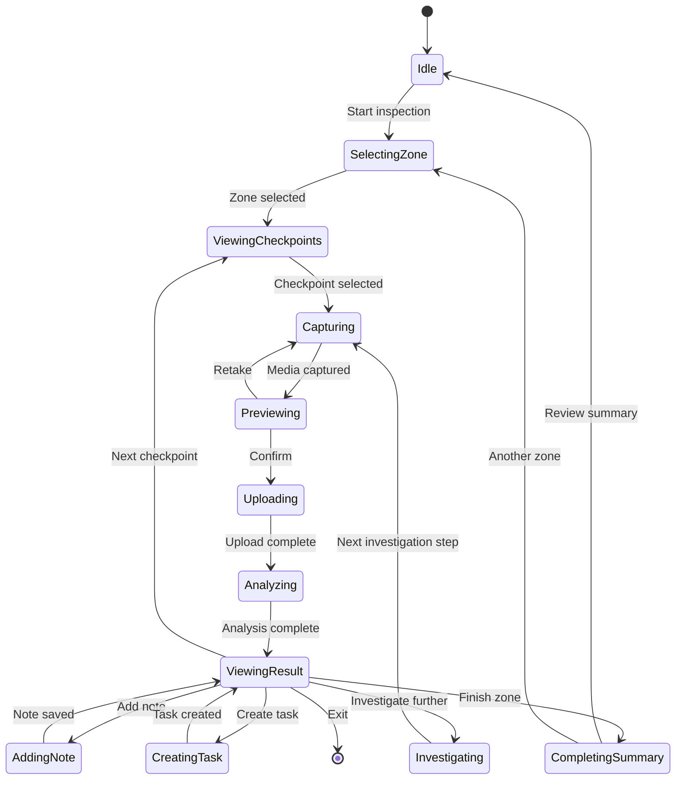

# Elton Inspector - User Flow Diagram

## Main Inspection Flow

```mermaid
flowchart TD
    START([Användare öppnar Inspector]) --> LANDING[Landing Screen]
    LANDING --> CHOICE{Välj åtgärd}
    
    CHOICE -->|Ny inspektion| SELECT_ZONE
    CHOICE -->|Fortsätt tidigare| RESUME
    CHOICE -->|Visa historik| HISTORY
    
    SELECT_ZONE[Välj Inspektionszon] --> ZONE_DETAIL[Visa Zon-detaljer]
    ZONE_DETAIL --> CHECKLIST[Checkpoint-lista]
    
    CHECKLIST --> SELECT_CP[Välj Checkpoint]
    SELECT_CP --> CP_DETAIL[Visa Instruktion & Tips]
    
    CP_DETAIL --> CAPTURE_CHOICE{Capture-typ?}
    
    CAPTURE_CHOICE -->|Foto| CAMERA[Öppna Kamera]
    CAPTURE_CHOICE -->|Ljud| MIC[Starta Ljudinspelning]
    CAPTURE_CHOICE -->|Både| CAMERA
    
    CAMERA --> TAKE_PHOTO[Ta Foto]
    TAKE_PHOTO --> PREVIEW_IMG[Förhandsgranska]
    
    PREVIEW_IMG --> CONFIRM_IMG{Godkänn?}
    CONFIRM_IMG -->|Nej| CAMERA
    CONFIRM_IMG -->|Ja| UPLOAD
    
    MIC --> RECORD[Spela in 10-30 sek]
    RECORD --> PREVIEW_AUD[Lyssna igenom]
    PREVIEW_AUD --> CONFIRM_AUD{Godkänn?}
    CONFIRM_AUD -->|Nej| MIC
    CONFIRM_AUD -->|Ja| UPLOAD
    
    UPLOAD[Ladda upp till Firebase] --> COMPRESS[Komprimera media]
    COMPRESS --> STORAGE[Spara i Cloud Storage]
    STORAGE --> CREATE_DOC[Skapa Finding-dokument]
    
    CREATE_DOC --> TRIGGER_AI[Trigger Cloud Function]
    TRIGGER_AI --> WAIT[Visa 'AI analyserar...']
    
    WAIT --> AI_COMPLETE[AI-analys klar]
    AI_COMPLETE --> RESULT_SCREEN[Visa Resultat]
    
    RESULT_SCREEN --> SEVERITY_CHECK{Allvarlighetsgrad?}
    
    SEVERITY_CHECK -->|COSMETIC| COSMETIC_RESULT
    SEVERITY_CHECK -->|WARNING| WARNING_RESULT
    SEVERITY_CHECK -->|CRITICAL| CRITICAL_RESULT
    
    COSMETIC_RESULT[Visa info - ingen åtgärd nödvändig] --> USER_ACTION
    
    WARNING_RESULT[Visa varning - bör åtgärdas] --> SUGGEST_TASK
    SUGGEST_TASK[Föreslå task-skapande] --> USER_ACTION
    
    CRITICAL_RESULT[Visa KRITISK varning] --> AUTO_TASK
    AUTO_TASK[Skapa task automatiskt] --> NOTIFY_USER
    NOTIFY_USER[Push-notis om kritiskt fynd] --> USER_ACTION
    
    USER_ACTION{Användare väljer}
    
    USER_ACTION -->|Lägg till anteckning| ADD_NOTE[Textfält för notering]
    ADD_NOTE --> SAVE_NOTE[Spara anteckning] --> NEXT
    
    USER_ACTION -->|Skapa task| MANUAL_TASK[Visa task-formulär]
    MANUAL_TASK --> FILL_TASK[Fyll i detaljer]
    FILL_TASK --> SAVE_TASK[Spara task] --> NEXT
    
    USER_ACTION -->|Undersök mer| INVESTIGATE
    INVESTIGATE[Starta Investigation Tree] --> NEXT_LEVEL
    NEXT_LEVEL --> CAPTURE_CHOICE
    
    USER_ACTION -->|Nästa checkpoint| NEXT
    USER_ACTION -->|Avsluta| SUMMARY
    
    NEXT{Fler checkpoints?}
    NEXT -->|Ja| CHECKLIST
    NEXT -->|Nej, men annan zon| SELECT_ZONE
    NEXT -->|Nej, klart| SUMMARY
    
    RESUME[Ladda tidigare session] --> CHECKLIST
    HISTORY[Visa alla findings] --> FILTER
    FILTER[Filtrera per zon/severity] --> FINDING_LIST
    FINDING_LIST --> FINDING_DETAIL
    FINDING_DETAIL --> RESULT_SCREEN
    
    SUMMARY[Visa Sammanfattning] --> STATS
    STATS[Statistik: X fynd, Y kritiska, Z tasks skapade] --> DONE
    
    DONE([Inspektion Klar])
    
    style AI_COMPLETE fill:#4285f4
    style CRITICAL_RESULT fill:#ea4335
    style AUTO_TASK fill:#fbbc04
    style DONE fill:#34a853
```

## Critical Path Timing

| Steg | Genomsnittlig tid | Kommentar |
|------|-------------------|-----------|
| Välj zon | 5 sek | Snabb navigation |
| Läs checkpoint-instruktion | 10-15 sek | Tips & guidance |
| Ta foto | 5-10 sek | Flera försök om dåligt ljus |
| Upload | 2-5 sek | Beror på nätverkshastighet |
| AI-analys | 3-8 sek | Gemini 2.5 Flash |
| Läs resultat | 20-30 sek | Användare läser diagnos |
| Beslut (åtgärd) | 10-20 sek | Skapa task, notera, etc |
| **Total per checkpoint** | **55-95 sek** | ~1-1.5 min per punkt |

### Optimeringar för snabbare flow

1. **Pre-load kamera** medan instruktion visas
2. **Parallel upload** - börja analysera medan upload pågår
3. **Predictive pre-fetch** av nästa checkpoint
4. **Batch analysis** - analysera flera bilder samtidigt

## Alternative Flows

### Quick Scan Mode
För erfarna användare som vill fotografera snabbt utan att följa strukturerad checklista:

### Voice-Guided Inspection
För händsfri operation (användbar när man ligger under bilen):

## Error Handling Flows

### Upload Failure

### AI Analysis Failure

## State Machine

## Performance Metrics

Målvärden för användarupplevelse:

| Metric | Target | Kritiskt (max) |
|--------|--------|----------------|
| Kamera-startup | <500ms | 1s |
| Upload-tid | <3s | 5s |
| AI-analys | <5s | 10s |
| Total tid per checkpoint | <90s | 2min |
| App launch → första foto | <5s | 8s |
| Offline-läge funktionalitet | 100% | - |
| Crash rate | <0.1% | 1% |

