# 🔍 Elton Inspector - Komplett Dokumentation

**AI-Assisterad Fordonsinspektions-modul för Elton App**

---

## 📋 Innehållsförteckning

1. [Koncept & Vision](#koncept--vision)
2. [Systemöversikt](#systemöversikt)
3. [Datamodell](#datamodell)
4. [Användarflöde](#användarflöde)
5. [AI-Logik & Prompts](#ai-logik--prompts)
6. [Inspektionszoner](#inspektionszoner)
7. [Eskaleringslogik](#eskaleringslogik)
8. [Implementation](#implementation)
9. [Användningsscenarier](#användningsscenarier)

---

## 🎯 Koncept & Vision

### "Snap & Triage" - Filosofin

**Problemet:** Traditionella inspektioner kräver omfattande dokumentation och expertis.

**Lösningen:** Låt AI vara mekanikern. Användaren dokumenterar bara med kamera och mikrofon.

```
Traditionell metod:          Elton Inspector:
═══════════════════         ═══════════════
1. Skriv rapport            1. Ta foto/ljud
2. Konsultera manual        2. AI analyserar  
3. Bedöm allvar             3. Få diagnos + åtgärd
4. Planera åtgärd           4. Konvertera till task
Tid: 30-60 min              Tid: 2-5 min
```

### Kärnfunktioner

- 📸 **Visuell AI-analys** - Identifiera rost, sprickor, läckage
- 🎤 **Ljudanalys** - Diagnostisera motorljud, skrammel
- 🎯 **Smart Triage** - Automatisk allvarlighetsgradering
- 🔄 **Task-konvertering** - Från fynd till åtgärdsplan på ett klick
- 📊 **Progressionsspårning** - Se förbättring över tid

---

## 🏗️ Systemöversikt

### Arkitekturdiagram


### Teknisk Stack

| Komponent | Teknologi | Syfte |
|-----------|-----------|-------|
| **Frontend** | React Native + TypeScript | Mobilapp med native kamera-access |
| **Backend** | Firebase (Firestore, Storage, Functions) | Serverlös backend |
| **AI Engine** | Google Gemini 2.5 Flash | Multimodal analys (bild + ljud) |
| **State** | Zustand / Redux | Lokal state management |
| **Media** | react-native-camera, expo-av | Media capture |

---

## 📊 Datamodell

### ER-Diagram


### TypeScript Interfaces

```typescript
// Core Finding Model
export interface InspectionFinding {
  // Identity
  id: string;
  projectId: string;
  createdAt: string;
  updatedAt: string;
  
  // Media
  imageUrl?: string;
  audioUrl?: string;
  thumbnailUrl?: string;
  
  // Classification
  category: InspectionCategory;
  zoneId: string;
  checkpointId?: string;
  
  // AI Analysis
  aiAnalysis: AIAnalysis;
  
  // Task Integration
  convertedToTaskId?: string;
  
  // User Notes
  userNotes?: string;
  userTags?: string[];
}

export type InspectionCategory = 
  | 'EXTERIOR'      // Skalet - Karosseri, lack, glas
  | 'ENGINE'        // Hjärtat - Motor, vätskor
  | 'UNDERCARRIAGE' // Skelettet - Balkar, avgassystem
  | 'INTERIOR';     // Kontoret - Inredning, instrument

export interface AIAnalysis {
  // Diagnosis
  diagnosis: string;              // "Kraftig korrosion på längsgående balk..."
  component?: string;             // "Längsgående balk höger"
  condition: ConditionAssessment;
  
  // Severity & Priority
  severity: SeverityLevel;
  confidence: number;             // 0-100%
  urgency: UrgencyLevel;
  
  // Recommendations
  suggestedActions: Action[];
  estimatedCost?: CostEstimate;
  requiresExpert: boolean;
  
  // Investigation
  nextSteps?: InvestigationStep[];
  relatedFindings?: string[];     // IDs of related findings
  
  // Metadata
  analyzedAt: string;
  modelVersion: string;
  processingTime: number;         // ms
}

export type SeverityLevel = 
  | 'COSMETIC'   // Estetiskt - ingen akut risk
  | 'WARNING'    // Bör åtgärdas - följ upp
  | 'CRITICAL';  // Akut - stoppa användning

export type UrgencyLevel =
  | 'LOW'        // Kan vänta > 6 månader
  | 'MEDIUM'     // Inom 1-6 månader
  | 'HIGH'       // Inom 1 månad
  | 'IMMEDIATE'; // Direkt åtgärd

export interface Action {
  type: 'REPAIR' | 'REPLACE' | 'INVESTIGATE' | 'MONITOR';
  description: string;
  difficulty: 'DIY' | 'MECHANIC' | 'SPECIALIST';
  estimatedHours?: number;
  priority: number; // 1-5
}

export interface InvestigationStep {
  level: 1 | 2 | 3; // Non-invasive, Minor, Major
  instruction: string;
  trigger?: string; // Vad som ska trigga detta steg
  toolsNeeded?: string[];
}

export interface CostEstimate {
  min: number;
  max: number;
  currency: string;
  breakdown?: {
    parts: number;
    labor: number;
  };
}

// Inspection Zones
export interface InspectionZone {
  id: string;
  name: string;
  icon: string;
  description: string;
  category: InspectionCategory;
  checkpoints: Checkpoint[];
  estimatedTime: number; // minuter
  sortOrder: number;
}

export interface Checkpoint {
  id: string;
  name: string;
  instruction: string;
  captureType: 'PHOTO' | 'AUDIO' | 'BOTH';
  tips?: string[];
  commonIssues?: string[];
}

// Condition Assessment
export interface ConditionAssessment {
  overall: 'EXCELLENT' | 'GOOD' | 'FAIR' | 'POOR' | 'CRITICAL';
  rust?: RustAssessment;
  mechanical?: MechanicalAssessment;
  electrical?: ElectricalAssessment;
}

export interface RustAssessment {
  level: 'NONE' | 'SURFACE' | 'MODERATE' | 'SEVERE' | 'STRUCTURAL';
  location: string;
  isPenetrating: boolean;
  affectsStructure: boolean;
}

export interface MechanicalAssessment {
  functionality: 'WORKING' | 'DEGRADED' | 'FAILED';
  wear: number; // 0-100%
  needsAdjustment: boolean;
  needsReplacement: boolean;
}

export interface ElectricalAssessment {
  isWorking: boolean;
  voltage?: number;
  hasCorrosion: boolean;
  needsReplacement: boolean;
}
```

---

## 🔄 Användarflöde

### Huvudflöde - Från Upptäckt till Åtgärd

```mermaid
flowchart TD
    START([Användare öppnar Inspector]) --> SELECT[Välj Inspektionszon]
    SELECT --> CHECKLIST[Visa Checkpoint-lista]
    CHECKLIST --> CAPTURE{Välj Capture-typ}
    
    CAPTURE -->|Foto| PHOTO[Ta foto]
    CAPTURE -->|Ljud| AUDIO[Spela in ljud]
    CAPTURE -->|Både| BOTH[Foto + Ljud]
    
    PHOTO --> UPLOAD[Ladda upp till Firebase]
    AUDIO --> UPLOAD
    BOTH --> UPLOAD
    
    UPLOAD --> PROCESS[Trigger Cloud Function]
    PROCESS --> AI[Gemini Analys]
    
    AI --> VISION{Innehållstyp}
    VISION -->|Bild| IMG_ANALYSIS[Visuell Analys]
    VISION -->|Ljud| AUDIO_ANALYSIS[Ljudanalys]
    
    IMG_ANALYSIS --> DIAGNOSE[Generera Diagnos]
    AUDIO_ANALYSIS --> DIAGNOSE
    
    DIAGNOSE --> SEVERITY[Klassificera Allvarlighetsgrad]
    SEVERITY --> CONFIDENCE[Beräkna Konfidens]
    
    CONFIDENCE --> RESULT[Skapa InspectionFinding]
    RESULT --> STORE[Spara i Firestore]
    
    STORE --> DISPLAY[Visa Resultat i App]
    DISPLAY --> ACTION{Användare väljer}
    
    ACTION -->|Notera| NOTE[Lägg till anteckning]
    ACTION -->|Konvertera| TASK_CREATE[Skapa Task automatiskt]
    ACTION -->|Undersök mer| INVESTIGATE[Starta Investigation Tree]
    ACTION -->|Avfärda| DISMISS[Markera som hanterad]
    
    NOTE --> DONE
    TASK_CREATE --> DONE
    INVESTIGATE --> LEVEL2[Eskalera till nivå 2]
    DISMISS --> DONE
    
    LEVEL2 --> CAPTURE
    DONE([Klar])
    
    style AI fill:#4285f4
    style DIAGNOSE fill:#34a853
    style SEVERITY fill:#ea4335
    style TASK_CREATE fill:#fbbc04
```



### Sekvensdiagram - AI-Analysprocessen

```mermaid
sequenceDiagram
    participant U as Användare
    participant A as App
    participant S as Firebase Storage
    participant F as Cloud Function
    participant G as Gemini API
    participant D as Firestore
    
    U->>A: Tar foto av rost
    A->>A: Komprimera bild
    A->>S: Ladda upp bild
    S-->>A: imageUrl
    
    A->>D: Skapa Finding (pending)
    A->>F: Trigger analyzeFinding(findingId)
    
    F->>S: Hämta bild
    S-->>F: bilddata
    
    F->>G: Skicka bild + Mechanic Prompt
    Note over G: Vision + Text analys
    G->>G: Identifiera komponent
    G->>G: Bedöm skick
    G->>G: Klassificera allvar
    G-->>F: AI Response JSON
    
    F->>F: Parse & validera
    F->>F: Beräkna confidence
    F->>F: Generera suggestedActions
    
    F->>D: Uppdatera Finding med aiAnalysis
    D-->>A: Real-time update
    
    A->>U: Visa diagnos & rekommendation
    
    alt Kritiskt fynd
        A->>U: Visa varning
        A->>A: Föreslå task-skapande
    end
    
    alt Låg konfidens (<70%)
        A->>U: Föreslå ny vinkel/ljus
    end
```



---

## 🤖 AI-Logik & Prompts

### Mechanic Agent - System Prompt

```typescript
const MECHANIC_SYSTEM_PROMPT = `
Du är en expertmekaniker med 30 års erfarenhet, specialiserad på veteranbilar från 1950-1990-talet.

Din uppgift är att analysera bilder och ljudinspelningar av fordon och ge professionella bedömningar.

ANALYSPROTOKOLL:

1. IDENTIFIKATION
   - Identifiera exakt komponent/område
   - Namnge enligt svensk mekanikterminologi
   - Referera till fordonstyp om synlig

2. TILLSTÅNDSBEDÖMNING
   - Beskriv observerad skada/slitage
   - Använd specifika termer (t.ex. "genomgående korrosion", "ytlig ytrost")
   - Var objektiv och faktabaserad

3. ALLVARLIGHETSBEDÖMNING
   Klassificera enligt:
   - COSMETIC: Endast estetisk påverkan, ingen säkerhetsrisk
   - WARNING: Bör åtgärdas inom 1-6 månader, kan förvärras
   - CRITICAL: Akut säkerhetsrisk eller bärande konstruktion påverkad

4. REKOMMENDATIONER
   - Ge konkreta åtgärdsförslag
   - Ange svårighetsgrad (DIY/Mekaniker/Specialist)
   - Uppskatta kostnad om möjligt (svensk marknad)

REGLER:
- Var PESSIMISTISK gällande rost på bärande delar (balkar, fjäderfästen, karosserisömmar)
- Vid genomgående rost i bärande delar: alltid CRITICAL
- Om osäker på djup/omfattning: föreslå INVESTIGATION med poka-test
- Referera till besiktningskrav när relevant
- Använd svensk terminologi
- Svara ALLTID på svenska
- Outputformat: JSON enligt specificerat schema
`;
```

### Vision Analysis Prompt Template

```typescript
interface VisionPromptContext {
  category: InspectionCategory;
  checkpoint?: string;
  userContext?: string;
}

function buildVisionPrompt(context: VisionPromptContext): string {
  const basePrompt = MECHANIC_SYSTEM_PROMPT;
  
  const specificGuidance = {
    EXTERIOR: `
      FOKUSOMRÅDEN:
      - Lackskador: Stenskott, repor, färgbläddring
      - Rost: Exakt läge, är det ytlig/genomgående/strukturell?
      - Karrosserideformation: Buckla, spricka, sömskada
      - Glas: Sprickor (besiktningskrav), stenslag
      - Gummilister: Torkning, sprickor, lossnade
    `,
    ENGINE: `
      FOKUSOMRÅDEN:
      - Vätskeläckage: Färg, läge, omfattning
      - Oljetillstånd: Färg, viskositet, "majonnäs"-test
      - Remmar/slangar: Sprickor, slitage, ålder
      - Motorljud (om ljud): Typ av ljud, följer RPM?, läge
      - Kablar: Korrosion, isolering, anslutningar
    `,
    UNDERCARRIAGE: `
      FOKUSOMRÅDEN:
      - Balkar: Rost (CRITICAL vid genomgående!), deformation
      - Avgassystem: Korrosion, läckage, fästen
      - Bromssystem: Läckage, slitage på rör, färg på vätska
      - Fjädring: Rost på fästen, oljeläckage
    `,
    INTERIOR: `
      FOKUSOMRÅDEN:
      - Instrument: Fungerande? Ljus? Visare?
      - Golvmattor: Fukt under? Rost genom golv?
      - Säten: Slitage, sprickor, hål
      - Dörrar: Funktion, tätningar, fönsterhissar
    `
  };
  
  return `${basePrompt}\n\n${specificGuidance[context.category]}\n\nAnvändarkontext: ${context.userContext || 'Ingen'}`;
}
```

### Audio Analysis Prompt

```typescript
const AUDIO_ANALYSIS_PROMPT = `
Du analyserar LJUDINSPELNING från ett fordon.

LJUDKATEGORIER:

MOTORLJUD:
- Tickning: Ventiler, lyftare, kedja
- Knackning: Vevstakelager, huvudlager
- Vissling: Remmar, lager
- Kraftigt bankande: Stora lager, pleuger

AVGASLJUD:
- Borrande ljud: Läckage
- Raspigt: Rostig hål
- Väsande: Packning

CHASSI:
- Skrammel: Lösa fästen, slitet gummi
- Knakande: Fjädring, upphängning
- Gnisslande: Bromsar

ANALYS:
1. Identifiera ljudtyp exakt
2. Lokalisera källa (så specifikt som möjligt)
3. Bedöm allvarlighetsgrad
4. Föreslå diagnostiska frågor (t.ex. "Följer ljudet motorvarvtalet?")

Output: JSON enligt schema
`;
```

### Investigation Tree Logic

```mermaid
flowchart TD
    START([AI Initial Diagnos]) --> CONF{Konfidens?}
    
    CONF -->|>80%| CERTAIN[Säker diagnos]
    CONF -->|50-80%| UNCERTAIN[Osäker diagnos]
    CONF -->|<50%| UNKNOWN[Okänd orsak]
    
    CERTAIN --> SEV{Severity?}
    SEV -->|COSMETIC| MONITOR[Föreslå monitorering]
    SEV -->|WARNING| ACTION[Föreslå åtgärd]
    SEV -->|CRITICAL| URGENT[Skapa urgent task]
    
    UNCERTAIN --> LEVEL1[NIVÅ 1: Icke-invasiv]
    LEVEL1 --> L1_ACT[Föreslå: Bättre foto, annat ljus, mätning]
    L1_ACT --> USER1[Användare utför]
    USER1 --> RE_ANALYZE[Ny AI-analys]
    
    RE_ANALYZE --> CONF2{Ökad konfidens?}
    CONF2 -->|Ja| CERTAIN
    CONF2 -->|Nej| LEVEL2
    
    UNKNOWN --> LEVEL2[NIVÅ 2: Minor Invasiv]
    LEVEL2 --> L2_ACT["Föreslå: Poka-test, mätverktyg, demo"]
    L2_ACT --> USER2[Användare utför]
    USER2 --> L2_RESULT{Resultat?}
    
    L2_RESULT -->|Bekräftat problem| LEVEL3
    L2_RESULT -->|Inget problem| FALSE_ALARM[Markera OK]
    L2_RESULT -->|Osäker| EXPERT
    
    LEVEL3[NIVÅ 3: Major Invasiv]
    LEVEL3 --> L3_ACT[Föreslå: Demontera, expert]
    L3_ACT --> EXPERT[Rekommendera professionell inspektion]
    
    MONITOR --> DONE([Loggad])
    ACTION --> DONE
    URGENT --> DONE
    FALSE_ALARM --> DONE
    EXPERT --> DONE
    
    style CERTAIN fill:#34a853
    style URGENT fill:#ea4335
    style EXPERT fill:#fbbc04
```



---

## 🗺️ Inspektionszoner

### Zone 1: EXTERIOR - "Skalet"

**Syfte:** Utvändig karosseri, lack, glas och tätningar

#### Checkpoints

```typescript
const EXTERIOR_CHECKPOINTS: Checkpoint[] = [
  {
    id: 'ext_001',
    name: 'Hjulhus Fram Höger',
    instruction: 'Fota insidan av hjulhuset. Leta efter rostbubblor och genomgående hål.',
    captureType: 'PHOTO',
    tips: [
      'Använd ficklampa för bättre sikt',
      'Fota både ovanför och nedanför',
      'Sikta på svetsade sömmar'
    ],
    commonIssues: ['Rostbubblor', 'Genomgående hål', 'Lös färg']
  },
  {
    id: 'ext_002',
    name: 'Fotsteg/Tröskel',
    instruction: 'Fota trösklar längs hela bilen. Poka försiktigt med skruvmejsel om rost finns.',
    captureType: 'PHOTO',
    tips: [
      'Fotografera både utsida och undersida',
      'Kolla under gummilisterna',
      'Poka MED försiktighet - vi vill inte göra hål!'
    ],
    commonIssues: ['Genomrostning', 'Konstruktionsrost', 'Svag tröskel']
  },
  {
    id: 'ext_003',
    name: 'Glasrutor',
    instruction: 'Fotografera alla rutor. Sök efter sprickor (speciellt framrutan).',
    captureType: 'PHOTO',
    tips: [
      'Foto framifrån för framruta',
      'Märk om spricka är i siktzonen'
    ],
    commonIssues: ['Spricka i siktzon (besiktning)', 'Stenslag', 'Lös gummi']
  },
  {
    id: 'ext_004',
    name: 'Lackskador',
    instruction: 'Dokumentera alla lackskador, bucklar och repor.',
    captureType: 'PHOTO',
    tips: [
      'Närbilder på varje skada',
      'Inkludera större område för kontext'
    ],
    commonIssues: ['Stenskott', 'Repor', 'Färgbläddring']
  }
];
```

**Vanliga fynd:**
- Rostbubblor i hjulhus → WARNING/CRITICAL
- Genomrostade tröskar → CRITICAL
- Spricka i framruta → WARNING (besiktning)

---

### Zone 2: ENGINE - "Hjärtat"

**Syfte:** Motorrum, vätskor, remmar och elektriska komponenter

#### Checkpoints

```typescript
const ENGINE_CHECKPOINTS: Checkpoint[] = [
  {
    id: 'eng_001',
    name: 'Oljesticka - Majonnästest',
    instruction: 'Dra upp oljestickan. Fota nära. Sök efter vit "majonnäs" (vatten i oljan).',
    captureType: 'PHOTO',
    tips: [
      'Torka av, vänta, dra upp igen för bästa bild',
      'Majonnäs = cylinder head gasket läcker',
      'Kolla även undersidan av lock'
    ],
    commonIssues: ['Vatten i olja', 'Smutsig olja', 'Fel nivå']
  },
  {
    id: 'eng_002',
    name: 'Kylvätska',
    instruction: 'Fota expansionskärl eller kylare. Kolla färg och nivå.',
    captureType: 'PHOTO',
    tips: [
      'GÖR INTE PÅ VARM MOTOR!',
      'Färg ska vara grön/röd - ej brun',
      'Olja i kylarvatten = allvarligt'
    ],
    commonIssues: ['Olja i kylvatten', 'Låg nivå', 'Rostfärgat']
  },
  {
    id: 'eng_003',
    name: 'Motorljud',
    instruction: 'Spela in motorljud i tomgång och vid gas. 30 sekunder vardera.',
    captureType: 'AUDIO',
    tips: [
      'Stå nära motorn',
      'Spela in från olika sidor',
      'Notera om ljud följer varvtal'
    ],
    commonIssues: ['Tickande (ventiler)', 'Knackande (lager)', 'Vissling (remmar)']
  },
  {
    id: 'eng_004',
    name: 'Remmar & Slangar',
    instruction: 'Fota alla synliga remmar och slangar. Sök efter sprickor.',
    captureType: 'PHOTO',
    tips: [
      'Böj remmar försiktigt - sprickor syns bättre',
      'Slangarna: hårda = gamla, mjuka = bra'
    ],
    commonIssues: ['Sprucken rem', 'Gammal slang', 'Läckage']
  }
];
```

**Vanliga fynd:**
- Majonnäs på oljestickan → CRITICAL (topplockspackning)
- Tickande motorljud → WARNING (ventiljustering)
- Sprucken kamrem → CRITICAL (motorhaveri)

---

### Zone 3: UNDERCARRIAGE - "Skelettet"

**Syfte:** Undersida, balkar, avgassystem, fjädring

#### Checkpoints

```typescript
const UNDERCARRIAGE_CHECKPOINTS: Checkpoint[] = [
  {
    id: 'und_001',
    name: 'Längsgående Balkar',
    instruction: 'Fota längs båda sidor. Fokusera på svetsade sömmar och fästen.',
    captureType: 'PHOTO',
    tips: [
      'VIKTIGT: Balkar är bärande konstruktion',
      'Genomgående rost = CRITICAL',
      'Poka med skruvmejsel om misstänkt'
    ],
    commonIssues: ['Konstruktionsrost', 'Genomrostning', 'Buckla']
  },
  {
    id: 'und_002',
    name: 'Avgassystem',
    instruction: 'Fota hela avgassystemet. Lyssna efter läckage.',
    captureType: 'BOTH',
    tips: [
      'Borrande ljud = läckage',
      'Kolla rostiga hål',
      'Fästen: lösa = skrammel'
    ],
    commonIssues: ['Rostigt hål', 'Läckande packning', 'Löst fäste']
  },
  {
    id: 'und_003',
    name: 'Bromsrör',
    instruction: 'Fotografera bromsrör längs hela undersidan.',
    captureType: 'PHOTO',
    tips: [
      'Leta efter fukt/vätska',
      'Rost på rör = kritiskt',
      'Kolla kopplingar'
    ],
    commonIssues: ['Läckage', 'Rostiga rör', 'Lös koppling']
  }
];
```

**Vanliga fynd:**
- Genomrostad längsbalk → CRITICAL (bärande konstruktion)
- Rostigt avgassystem → COSMETIC/WARNING
- Bromsläckage → CRITICAL

---

### Zone 4: INTERIOR - "Kontoret"

**Syfte:** Inredning, instrument, komfort

#### Checkpoints

```typescript
const INTERIOR_CHECKPOINTS: Checkpoint[] = [
  {
    id: 'int_001',
    name: 'Instrumentpanel',
    instruction: 'Fota instrumentpanel med tändning på. Dokumentera fungerande/icke-fungerande instrument.',
    captureType: 'PHOTO',
    tips: [
      'Alla lampor ska lysa vid tändning på',
      'Testa varje instrument (hastighetsmätare, bränsle, temp)',
      'Notera varningslampor som inte slocknar'
    ],
    commonIssues: ['Icke-fungerande mätare', 'Trasiga lampor', 'Varningslampa']
  },
  {
    id: 'int_002',
    name: 'Golvmattor - Fukttest',
    instruction: 'Lyft golvmattor. Känn med hand efter fukt. Fota eventuella rostfläckar.',
    captureType: 'PHOTO',
    tips: [
      'Fukt = läckage eller genomrostad botten',
      'Kolla särskilt fram vid fotbrunnar',
      'Rost genom golv = CRITICAL'
    ],
    commonIssues: ['Fuktigt golv', 'Rost genom golv', 'Lukt av mögel']
  }
];
```

---

## 🔥 Eskaleringslogik

### The Investigation Tree

```typescript
interface InvestigationTree {
  levels: InvestigationLevel[];
}

interface InvestigationLevel {
  level: 1 | 2 | 3;
  name: string;
  description: string;
  triggerCondition: string;
  actions: InvestigationAction[];
}

const INVESTIGATION_TREE: InvestigationTree = {
  levels: [
    {
      level: 1,
      name: 'Icke-invasiv Undersökning',
      description: 'Initial observation utan att röra eller öppna något',
      triggerCondition: 'AI konfidens < 80% ELLER severity = WARNING',
      actions: [
        {
          type: 'VISUAL_RECHECK',
          instruction: 'Ta ny bild från annan vinkel med bättre ljus',
          tools: ['Ficklampa', 'Spegel'],
          expectedResult: 'Tydligare bild för bättre AI-analys'
        },
        {
          type: 'MEASUREMENT',
          instruction: 'Mät spricka/rostområde med linjal eller tumstock',
          tools: ['Måttband'],
          expectedResult: 'Exakt storlek för dokumentation'
        },
        {
          type: 'AUDIO_ANALYSIS',
          instruction: 'Spela in ljud under olika förhållanden (tomgång, gas, belastning)',
          tools: ['Mikrofon'],
          expectedResult: 'Identifiera ljudkälla'
        }
      ]
    },
    {
      level: 2,
      name: 'Minor Invasiv Undersökning',
      description: 'Lätt fysisk interaction - poka, trycka, mäta djup',
      triggerCondition: 'Nivå 1 inte gav svar ELLER AI rekommenderar',
      actions: [
        {
          type: 'POKE_TEST',
          instruction: 'Poka FÖRSIKTIGT med avrundad skruvmejsel i misstänkt rostområde',
          tools: ['Flat skruvmejsel', 'Våttrasa'],
          warning: 'Poka inte för hårt - vi vill inte skapa hål!',
          expectedResult: 'Fastställ om rost är ytlig eller genomgående'
        },
        {
          type: 'MAGNET_TEST',
          instruction: 'Använd magnet för att upptäcka spackel/plast-fyllning',
          tools: ['Stark magnet'],
          expectedResult: 'Identifiera dold spackling'
        },
        {
          type: 'MOISTURE_TEST',
          instruction: 'Använd fuktmätare i golv, tak, dörrar',
          tools: ['Fuktmätare'],
          expectedResult: 'Hitta dolda läckage'
        }
      ]
    },
    {
      level: 3,
      name: 'Major Invasiv Undersökning',
      description: 'Kräver demontering eller professionell utrustning',
      triggerCondition: 'Nivå 2 bekräftade allvarligt problem',
      actions: [
        {
          type: 'EXPERT_INSPECTION',
          instruction: 'Boka tid hos professionell mekaniker för djupinspection',
          tools: ['Lyft', 'Diagnostisk utrustning', 'Röntgen (roströntgen)'],
          warning: 'Gå inte längre på egen hand',
          expectedResult: 'Professionell bedömning och offert'
        }
      ]
    }
  ]
};

interface InvestigationAction {
  type: string;
  instruction: string;
  tools: string[];
  warning?: string;
  expectedResult: string;
}
```

### Eskaleringsbeslut - AI Logic

```typescript
function determineEscalation(finding: InspectionFinding): InvestigationLevel | null {
  const { aiAnalysis } = finding;
  
  // Level 1: Låg konfidens eller osäker diagnos
  if (aiAnalysis.confidence < 80 && aiAnalysis.severity !== 'CRITICAL') {
    return INVESTIGATION_TREE.levels[0]; // Level 1
  }
  
  // Level 2: Misstänkt strukturell skada eller genomgående rost
  if (
    aiAnalysis.diagnosis.includes('misstänkt genomgående') ||
    aiAnalysis.diagnosis.includes('oklart djup') ||
    (aiAnalysis.severity === 'WARNING' && aiAnalysis.confidence < 70)
  ) {
    return INVESTIGATION_TREE.levels[1]; // Level 2
  }
  
  // Level 3: Bekräftat kritiskt tillstånd
  if (
    aiAnalysis.severity === 'CRITICAL' &&
    aiAnalysis.requiresExpert === true
  ) {
    return INVESTIGATION_TREE.levels[2]; // Level 3
  }
  
  return null; // Ingen eskalering behövs
}
```

---

## 💻 Implementation

### Cloud Function - AI Analysis Pipeline

```typescript
// functions/src/inspectionAnalyzer.ts

import * as functions from 'firebase-functions';
import { GoogleGenerativeAI } from '@google/generative-ai';
import { getStorage } from 'firebase-admin/storage';
import { getFirestore } from 'firebase-admin/firestore';

const genAI = new GoogleGenerativeAI(functions.config().gemini.api_key);

export const analyzeFinding = functions.https.onCall(async (data, context) => {
  // Auth check
  if (!context.auth) {
    throw new functions.https.HttpsError('unauthenticated', 'User must be authenticated');
  }
  
  const { findingId } = data;
  const db = getFirestore();
  const storage = getStorage();
  
  try {
    // 1. Hämta Finding från Firestore
    const findingDoc = await db.collection('inspectionFindings').doc(findingId).get();
    if (!findingDoc.exists) {
      throw new Error('Finding not found');
    }
    
    const finding = findingDoc.data() as InspectionFinding;
    
    // 2. Hämta media från Storage
    let mediaData: Buffer | null = null;
    let mediaType: 'image' | 'audio' | null = null;
    
    if (finding.imageUrl) {
      mediaData = await downloadFromStorage(finding.imageUrl);
      mediaType = 'image';
    } else if (finding.audioUrl) {
      mediaData = await downloadFromStorage(finding.audioUrl);
      mediaType = 'audio';
    }
    
    if (!mediaData) {
      throw new Error('No media to analyze');
    }
    
    // 3. Bygg AI prompt baserat på kategori
    const prompt = buildAnalysisPrompt(finding.category, finding.zoneId);
    
    // 4. Kör AI-analys
    const model = genAI.getGenerativeModel({ model: 'gemini-2.5-flash' });
    
    let result;
    if (mediaType === 'image') {
      const imagePart = {
        inlineData: {
          data: mediaData.toString('base64'),
          mimeType: 'image/jpeg'
        }
      };
      result = await model.generateContent([prompt, imagePart]);
    } else {
      // Audio analysis
      const audioPart = {
        inlineData: {
          data: mediaData.toString('base64'),
          mimeType: 'audio/mpeg'
        }
      };
      result = await model.generateContent([prompt, audioPart]);
    }
    
    // 5. Parse AI response
    const responseText = result.response.text();
    const aiAnalysis = parseAIResponse(responseText);
    
    // 6. Berika med metadata
    aiAnalysis.analyzedAt = new Date().toISOString();
    aiAnalysis.modelVersion = 'gemini-2.5-flash';
    
    // 7. Determine if investigation needed
    const investigationLevel = determineEscalation({...finding, aiAnalysis});
    if (investigationLevel) {
      aiAnalysis.nextSteps = investigationLevel.actions.map(a => ({
        level: investigationLevel.level,
        instruction: a.instruction,
        toolsNeeded: a.tools
      }));
    }
    
    // 8. Spara tillbaka till Firestore
    await db.collection('inspectionFindings').doc(findingId).update({
      aiAnalysis,
      updatedAt: new Date().toISOString()
    });
    
    // 9. Om CRITICAL, skapa automatisk task
    if (aiAnalysis.severity === 'CRITICAL') {
      await createTaskFromFinding(findingId, finding, aiAnalysis);
    }
    
    return {
      success: true,
      findingId,
      severity: aiAnalysis.severity,
      confidence: aiAnalysis.confidence
    };
    
  } catch (error) {
    console.error('Analysis failed:', error);
    throw new functions.https.HttpsError('internal', 'Analysis failed', error);
  }
});

function parseAIResponse(text: string): AIAnalysis {
  // AI ska returnera JSON enligt schema
  try {
    // Ta bort eventuella markdown code fences
    const cleanedText = text.replace(/```json\n?/g, '').replace(/```\n?/g, '');
    const parsed = JSON.parse(cleanedText);
    
    return {
      diagnosis: parsed.diagnosis,
      component: parsed.component,
      severity: parsed.severity,
      confidence: parsed.confidence,
      urgency: parsed.urgency || calculateUrgency(parsed.severity),
      suggestedActions: parsed.suggestedActions || [],
      requiresExpert: parsed.requiresExpert || false,
      condition: parsed.condition,
      processingTime: 0, // Fylls i senare
      modelVersion: '',
      analyzedAt: ''
    };
  } catch (err) {
    throw new Error(`Failed to parse AI response: ${err}`);
  }
}

function calculateUrgency(severity: SeverityLevel): UrgencyLevel {
  switch (severity) {
    case 'CRITICAL': return 'IMMEDIATE';
    case 'WARNING': return 'HIGH';
    case 'COSMETIC': return 'LOW';
    default: return 'MEDIUM';
  }
}

async function createTaskFromFinding(
  findingId: string, 
  finding: InspectionFinding, 
  analysis: AIAnalysis
) {
  const db = getFirestore();
  
  const task = {
    title: `Åtgärda: ${analysis.component || 'Fordonsproblem'}`,
    description: analysis.diagnosis,
    priority: analysis.severity === 'CRITICAL' ? 'HIGH' : 'MEDIUM',
    status: 'TODO',
    projectId: finding.projectId,
    sourceType: 'INSPECTION',
    sourceFindingId: findingId,
    createdAt: new Date().toISOString(),
    dueDate: calculateDueDate(analysis.urgency)
  };
  
  const taskRef = await db.collection('tasks').add(task);
  
  // Länka tillbaka
  await db.collection('inspectionFindings').doc(findingId).update({
    convertedToTaskId: taskRef.id
  });
  
  return taskRef.id;
}

function calculateDueDate(urgency: UrgencyLevel): string {
  const now = new Date();
  switch (urgency) {
    case 'IMMEDIATE':
      return new Date(now.getTime() + 7 * 24 * 60 * 60 * 1000).toISOString(); // 1 vecka
    case 'HIGH':
      return new Date(now.getTime() + 30 * 24 * 60 * 60 * 1000).toISOString(); // 1 månad
    case 'MEDIUM':
      return new Date(now.getTime() + 90 * 24 * 60 * 60 * 1000).toISOString(); // 3 månader
    case 'LOW':
      return new Date(now.getTime() + 180 * 24 * 60 * 60 * 1000).toISOString(); // 6 månader
  }
}
```

### React Native Component

```typescript
// src/components/Inspector/InspectorCamera.tsx

import React, { useState } from 'react';
import { View, Button, Image, Text, ActivityIndicator } from 'react-native';
import { Camera } from 'react-native-camera';
import { useInspector } from '../../hooks/useInspector';

interface Props {
  zoneId: string;
  checkpointId: string;
  onComplete: (finding: InspectionFinding) => void;
}

export const InspectorCamera: React.FC<Props> = ({ zoneId, checkpointId, onComplete }) => {
  const [capturedImage, setCapturedImage] = useState<string | null>(null);
  const [isAnalyzing, setIsAnalyzing] = useState(false);
  const { uploadAndAnalyze } = useInspector();
  
  const camera = React.useRef<Camera>(null);
  
  const takePicture = async () => {
    if (camera.current) {
      const options = { quality: 0.8, base64: false };
      const data = await camera.current.takePictureAsync(options);
      setCapturedImage(data.uri);
    }
  };
  
  const analyzePicture = async () => {
    if (!capturedImage) return;
    
    setIsAnalyzing(true);
    
    try {
      const finding = await uploadAndAnalyze({
        imageUri: capturedImage,
        zoneId,
        checkpointId,
        category: getCurrentCategory(zoneId)
      });
      
      onComplete(finding);
    } catch (error) {
      console.error('Analysis failed:', error);
      alert('Analys misslyckades. Försök igen.');
    } finally {
      setIsAnalyzing(false);
    }
  };
  
  if (isAnalyzing) {
    return (
      <View style={styles.loadingContainer}>
        <ActivityIndicator size="large" />
        <Text style={styles.loadingText}>AI analyserar bilden...</Text>
      </View>
    );
  }
  
  if (capturedImage) {
    return (
      <View style={styles.previewContainer}>
        <Image source={{ uri: capturedImage }} style={styles.preview} />
        <View style={styles.buttonRow}>
          <Button title="Ta om" onPress={() => setCapturedImage(null)} />
          <Button title="Analysera" onPress={analyzePicture} />
        </View>
      </View>
    );
  }
  
  return (
    <View style={styles.cameraContainer}>
      <Camera
        ref={camera}
        style={styles.camera}
        type={Camera.Constants.Type.back}
      />
      <Button title="Ta bild" onPress={takePicture} />
    </View>
  );
};
```

---

## 📖 Användningsscenarier

### Scenario A: Seam Rust Discovery

**Kontext:** Användare inspekterar tröskel och ser bubblor i lacken

```
STEG 1: Initial Discovery
User: Ser bubblor i tröskeln → Tar foto
AI: "Ytlig rostbildning under lack. Misstänkt genomgående rost. POKA-TEST rekommenderas."
   Severity: WARNING
   Confidence: 65%
   Next Step: Level 2 Investigation

STEG 2: Poke Test
User: Pokar försiktigt med skruvmejsel → Tar nytt foto
User Input: "Den smulas sönder när jag pokar"
AI: "BEKRÄFTAT: Genomgående rost i bärande konstruktion (tröskel)"
   Severity: CRITICAL
   Confidence: 95%
   Action: Auto-skapar Task "Rostlagning tröskel höger"

STEG 3: Task Created
Task Title: "BRÅDSKANDE: Rostlagning tröskel höger"
Priority: HIGH
Due: 7 dagar
Description: "Genomgående rost i bärande konstruktion. Kräver professionell reparation."
Estimated Cost: 8,000-15,000 SEK
```

### Scenario B: Engine Sound Diagnosis

**Kontext:** Användare hör konstigt ljud från motorn

```
STEG 1: Sound Capture
User: Spelar in motorljud i 30 sekunder
AI: "Tickande ljud från motorrummet. Frekvensprofil indikerar ventilspel."
   Severity: WARNING
   Confidence: 72%
   
AI Question: "Förändras ljudet med motorvarvtalet?"

STEG 2: Follow-up
User: "Ja, ljudet följer varvtalet"
AI: "Bekräftat: Ventilspel behöver justeras. Standard underhåll."
   Severity: WARNING → INFO
   Confidence: 88%
   Action: Skapa Task "Ventiljustering"
   Estimated Cost: 800-1,200 SEK (verkstad)
   DIY Option: Ja (svårighetsgrad: MEDIUM)
```

### Scenario C: Oil Contamination

**Kontext:** Användare drar upp oljestickan som del av motorinspektion

```
STEG 1: Photo Analysis
User: Fotograferar oljesticka nära
AI: "VARNING: Vit emulsion ('majonnäs') på oljesticka"
   Diagnosis: "Vatten i motoroljan - indikerar trasig topplockspackning"
   Severity: CRITICAL
   Confidence: 94%
   
STEG 2: Confirmation Questions
AI: "För att bekräfta:
   1. Syns majonnäs även under motorns oljepåfyllning?
   2. Ser du olja i kylvätskan (brunt/oljigt)?
   3. Vit rök från avgasröret?"

STEG 3: User Answers
User uploads photo of oil cap: "Ja, majonnäs under locket också"
User: "Ingen olja i kylvätskan"
User: "Lite vit rök vid kallstart"

AI Final Diagnosis:
"BEKRÄFTAT: Topplockspackning läcker. Kritiskt läge."
Action: Auto-skapa URGENT Task
Task: "Byt topplockspackning - SLUTA KÖRA!"
Estimated Cost: 8,000-25,000 SEK
Warning: "Kör inte bilen - risk för motorhaveri!"
```

### Scenario D: False Alarm - Surface Rust

**Kontext:** Användare ser rost på avgassystemet

```
STEG 1: Initial Photo
User: Fotograferar rostig avgasrördel
AI: "Ytlig rost på avgasrör. Inte strukturell del."
   Severity: COSMETIC
   Confidence: 85%
   
STEG 2: User Concern
User: "Är det farligt?"
AI: "Nej, avgassystemet är inte bärande. Rostigt avgassystem är normalt på äldre bilar."
   Recommendation: "Monitorera för läckage (lyssna efter borrande ljud)."
   Action: MONITOR (ingen task skapad)
   Next Inspection: 6 månader
```

---

## 🎨 UI/UX Mock

### Inspection Flow Screens

```
┌─────────────────────────┐
│  Inspector - Välj Zon   │
├─────────────────────────┤
│                         │
│  🚗 EXTERIOR (Skalet)   │
│  ├─ 8 checkpoints       │
│  └─ ⏱️ ~15 min           │
│                         │
│  🔧 ENGINE (Hjärtat)    │
│  ├─ 6 checkpoints       │
│  └─ ⏱️ ~20 min           │
│                         │
│  ⚙️ UNDERCARRIAGE       │
│  ├─ 5 checkpoints       │
│  └─ ⏱️ ~25 min           │
│                         │
│  🪑 INTERIOR (Kontoret) │
│  ├─ 4 checkpoints       │
│  └─ ⏱️ ~10 min           │
│                         │
└─────────────────────────┘

┌─────────────────────────┐
│  📸 Checkpoint: Tröskel │
├─────────────────────────┤
│                         │
│  ┌───────────────────┐  │
│  │                   │  │
│  │   [Kamera view]   │  │
│  │                   │  │
│  └───────────────────┘  │
│                         │
│  💡 Tips:               │
│  • Fota från sidan      │
│  • Använd ficklampa     │
│  • Poka om bubblor      │
│                         │
│  [ TA FOTO ]            │
│                         │
└─────────────────────────┘

┌─────────────────────────┐
│  🤖 AI Analyserar...    │
├─────────────────────────┤
│                         │
│      ⚡ Gemini 2.5      │
│                         │
│  ▓▓▓▓▓▓▓▓▓░░░ 75%      │
│                         │
│  ✓ Bild uppladdad       │
│  ✓ Komponent identifierad│
│  ⏳ Bedömer allvar...   │
│                         │
└─────────────────────────┘

┌─────────────────────────┐
│  ⚠️ Resultat: VARNING   │
├─────────────────────────┤
│  [Foto av tröskel]      │
│                         │
│  DIAGNOS:               │
│  Misstänkt genomgående  │
│  rost i tröskel höger   │
│                         │
│  ALLVAR: ⚠️ WARNING     │
│  KONFIDENS: 65%         │
│                         │
│  🔍 NÄSTA STEG:         │
│  Poka försiktigt med    │
│  skruvmejsel för att    │
│  testa djup.            │
│                         │
│  [ POKA-TEST ]          │
│  [ SKAPA TASK ]         │
│  [ AVFÄRDA ]            │
│                         │
└─────────────────────────┘
```

---

## 📈 Framtida Utbyggnad

### Phase 2 Features

1. **Historical Comparison**
    - Jämför samma punkt över tid
    - "Rostområdet har vuxit 15% sedan senaste inspektionen"

2. **AR-Guided Inspection**
    - AR-overlay som visar vart användaren ska fota
    - "Fota här" markers i real-time

3. **Multi-Vehicle Database**
    - Gemensam kunskap: "89% av Volvo 240 har rost här"
    - Modellspecifika checklists

4. **Expert Consultation**
    - Videochatt med mekaniker direkt från resultat
    - Dela findings med workshop för offert

5. **Predictive Maintenance**
    - ML som förutser nästa problem
    - "Baserat på dina fynd, undersök även..."

### Phase 3 - IoT Integration

- **OBD-II Integration**
    - Läs felkoder automatiskt
    - Korrelera med fysiska fynd

- **Sensor Monitoring**
    - Fukt-sensorer i kritiska områden
    - Pushnotis vid förändring

---

## 📚 Referenser & Standards

### Besiktningskrav (Sverige)

Relevanta krav som AI ska känna till:

- **Rost i bärande delar** → Underkänt
- **Spricka i framruta (siktzon)** → Underkänt
- **Bromsläckage** → Underkänt
- **Funktionsfel säkerhetsutrustning** → Underkänt

### Rostgrader (Svenska standarden)

1. **Ytrost** - Endast på yta, ej genomträngande
2. **Konstruktionsrost** - Inne i struktur men ej genomgående
3. **Genomrostning** - Hål genom metall
4. **Strukturell rostskada** - Bärande del försvagad

---

## 🔐 Säkerhet & Integritet

### Dataskydd

- Bilder lagras i användarens private storage bucket
- Ingen delning mellan användare utan explicit consent
- AI-analys sker server-side, ingen data sparas hos Gemini
- Användare kan radera findings (inklusive media) när som helst

### Privacy by Design

- Inga licensplåtar får synas i bilder (automatisk blur)
- Inga personuppgifter i diagnos
- Anonym analys-statistik för modellförbättring (opt-in)

---

## ✅ Summary - Elton Inspector

**What It Does:**
AI-assisterad fordonsinspektions-modul som analyserar bilder och ljud för att diagnostisera fordonsproblem.

**How It Works:**
1. User fotograferar/spelar in
2. AI (Gemini 2.5) analyserar
3. Diagnos + allvarlighetsgrad genereras
4. Automatisk task-skapande för kritiska fynd
5. Smart eskalering vid behov

**Key Benefits:**
- ⚡ Snabbt (2-5 min vs 30-60 min)
- 🎯 Triage (prioritera rätt åtgärder)
- 📊 Dokumentation (spårbar historik)
- 🔧 Actionable (direkt till tasks)

**Tech:**
React Native + Firebase + Gemini 2.5 Flash

---

*Dokumentation skapad: 2025-01-29*
*Version: 1.0*
*Status: Ready for Implementation*